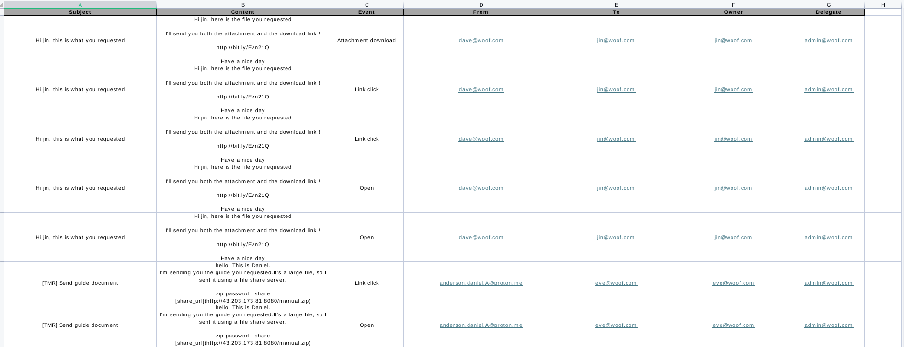
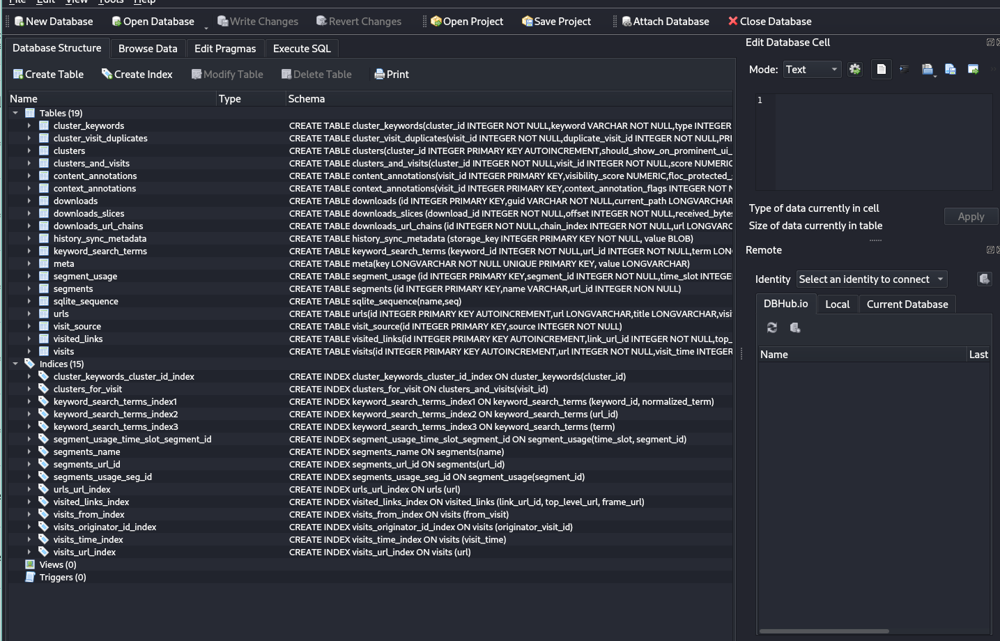
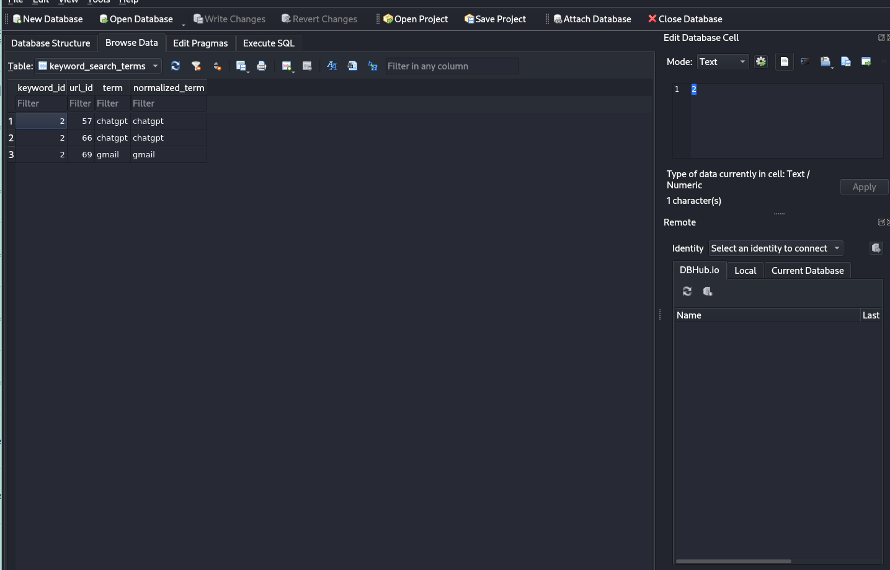
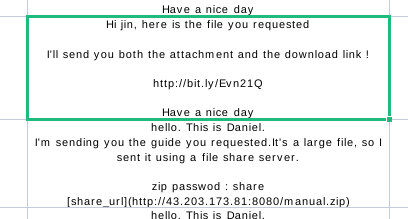
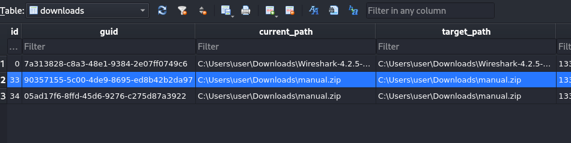

INJECT 02
-------------------------------------------------------------------------------------------------------------------------

Hình thức tấn công xâm nhập (100)
Kẻ tấn công đã dùng hình thức nào để tấn công, xâm nhập vào tổ chức? Lưu ý: Trả lời bằng số và chỉ được trả lời 1 lần.
1. Khai thác lỗ hổng phần mềm qua CVE
2. Khai thác lỗ hổng web
3. Bruteforce mật khẩu quản trị và khai thác lỗ hổng dịch vụ nội bộ
4. Phishing qua email
5. Tấn công tài khoản sa vủa MSSQL và thực hiện xp_cmdshell

Trả lời: 
- Tài liệu đính kèm gồm 2 file: History + workspace_mail_logs.xlsx
- Mở file workspace_mail_logs.xlsx phân tích. Sơ bộ đây là file log của mail, tiếp tục ta tìm được email chứa nội dung có file tải xuống là đẹp.
- Mục đích diễn tập này là về cuộc tấn công apt. Tấn công apt này phương án dò quét khai thác rấ t là tốn thời gian. Việc sử dụng kĩ thuật social engineering thông qua việc spam email có vẻ đỡ tốn tiền hơn. 
- Đồng thời nhắm đến người dùng thiếu kiến thức về bảo mật. Việc dò quét xâm nhập qua các hệ thống IDS/IPS, SIEM,... Rất mất thời gian.

- Nhìn ở phía dòng 6,7 ta thấy 1 nội dung chứa đường dẫn tải xuống, lại còn đường dẫn IP:PORT. 
=> câu trả lời 4.
-------------------------------------------------------------------------------------------------------------------------
Email của nạn nhân - người bị tấn công (100): 
- eve@woof.com
-------------------------------------------------------------------------------------------------------------------------
Email của kẻ tấn công (100):
- anderson.daniel.A@proton.me

-------------------------------------------------------------------------------------------------------------------------
Tên tệp nghi ngờ là mã độc (100)
- manual.zip
-------------------------------------------------------------------------------------------------------------------------
Nạn nhân đã tìm kiếm các thông tin gì?
Lựa chọn các mục sau:
1. ChatGPT
2. Proton
3. Gmail
4. Facebook
5. Github

Trả lời: 
- Tiếp tục mở file history còn lại 

- Tìm kiếm vào mục  keyword_search_iterms

=> câu trả lời là 1,3 
-------------------------------------------------------------------------------------------------------------------------
Password của tệp nén (100)

=> share
-------------------------------------------------------------------------------------------------------------------------
Tên người dùng của máy tính nghi ngờ nhiễm mã độc (100)
- 
- tìm  ở downloads thấy đường dẫn tải xuống: C:\Users\user\Downloads\manual.zip. 
=> user
